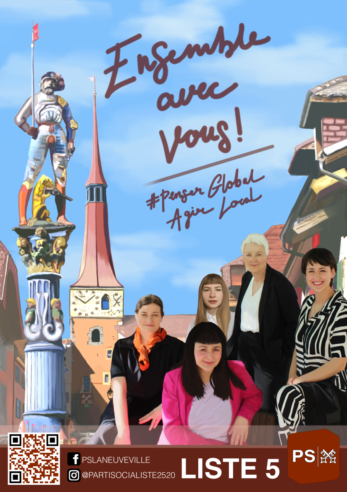

# C’est pas juste !
Qui n’a jamais prononcé ces mots face à une injustice ou un privilège immérité.
Le parti socialiste a fait sienne la lutte contre les inégalités à l’égard :
- des femmes
- des déshérités et des plus fragiles de notre société
- des familles
- des seniors
- de la formation scolaire
- des services publics
Il rêve d’une société où l’humain est au centre des préoccupations de la politique, à l’opposé d’un environnement impersonnel, sacrifié sur l’autel de l’économie et d’une digitalisation artificielle à outrance. Si vous partagez ces valeurs et ces préoccupations, vous devez soutenir le parti socialiste de La Neuveville en glissant les bulletins correspondant dans l’enveloppe / l’urne officielle.

# Au Conseil Municipal : 	Denise Bloch
Son engagement social n’est plus à démontrer (médecin, députée CJB, présidente de la fondation des Vignolans, co-présidente du parti, membre bénévole de diverses sociétés). 
Après 4 ans au Conseil Municipal, en charge des affaires sociales, elle estime que sa tâche n’est pas encore accomplie. Elle souhaite mener à terme ses projets en faveur de la justice sociale et sollicite votre soutien pour un nouveau mandat qui assurera également une présence féminine équitable au Conseil Municipal.

# Quatre sortantes au Conseil Général
Pour le Conseil Général, nous sommes fières de présenter: 

Caroline Brazier 	(sortante),
Adèle Torres 		(sortante), céramiste
Céleste Wingo 	(sortante), opticienne, matelot
Helvetial Wingo 	(sortante), enseignante

Toutes ces jeunes femmes se sont distinguées au cours de la dernière législature par le dépôt
de nombreuses motions et leur engagement sans faille au sein des différentes commissions 
en faveur de la défense et de l’amélioration de la qualité de vie à La Neuveville. Elles sollicitent votre soutien pour un nouveau mandat afin de poursuivre la défense des intérêts de toute la population.

Ensemble, sans privilège 

